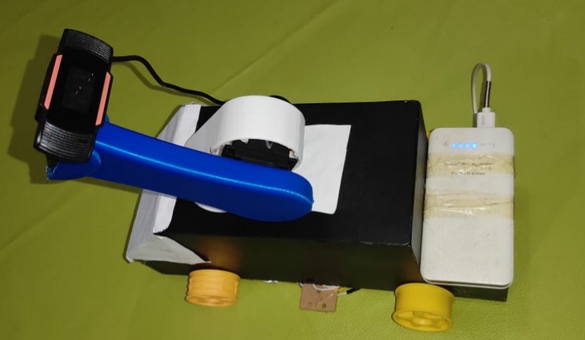
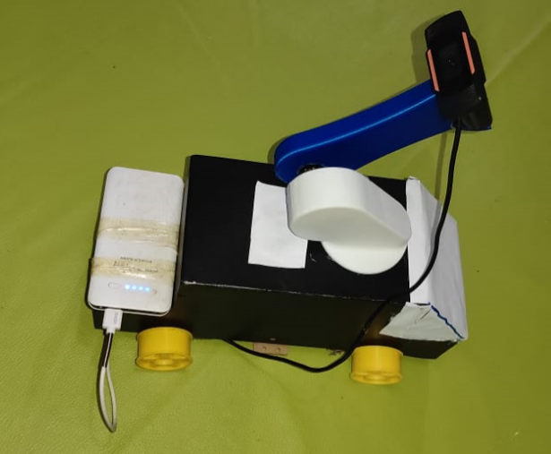

# RailGard — TGV Undercarriage Inspection Prototype

<p align="center">
  <strong>A multidisciplinary engineering project for robotic railway inspection</strong>
</p>

<p align="center">
  
</p>

<p align="center">
  <a href="https://github.com/KiaminoTaco/RailGard-TGV-Inspection-Prototype">
    
  </a>
  
  
  
</p>

<p align="center">
  <a href="https://github.com/KiaminoTaco/RailGard-TGV-Inspection-Prototype/issues">
    
  </a>
  <a href="https://github.com/KiaminoTaco/RailGard-TGV-Inspection-Prototype/commits/main">
    
  </a>
  <a href="https://github.com/KiaminoTaco/RailGard-TGV-Inspection-Prototype">
    
  </a>
</p>

---

## Project Overview

**RailGard** is a multidisciplinary engineering prototype developed as part of **SafeTrack — Robot Autonome d’Inspection Sous-Caisse TGV**.

The project explores the design and integration of a robotic platform intended to support the inspection of the lower structure and undercarriage areas of high-speed trains.

RailGard brings together several engineering disciplines, including mechanical design, robotics, embedded electronics, sensor integration, communication systems, computer vision, and software development.

The objective is to develop and demonstrate a physical robotic prototype that provides a foundation for further experimentation in railway inspection technologies.

> **Project scope:** RailGard is an experimental engineering prototype. It is not a certified railway inspection system and is not intended to replace approved railway inspection procedures.

## Physical Prototype

The following photographs show the current physical prototype.

### Main View

<p align="center">
  
</p>

### Side View

<p align="center">
  
</p>

## Prototype Demonstration

The repository includes a video demonstration of the physical prototype.

### RailGard — Prototype Demonstration

<video controls width="850" preload="metadata">
  <source src="media/videos/railgard-prototype-demo.mp4" type="video/mp4">
  Your browser does not support embedded video. Use the direct link below to view the demonstration.
</video>

[**Open the RailGard prototype demonstration video**](media/videos/railgard-prototype-demo.mp4)

*Note: GitHub may not render repository-hosted MP4 files as an embedded video player in every view. The direct link above provides an alternative.*

---

## Project Objectives

The main objectives of RailGard are to:

- Design and develop a mobile robotic platform for experimental railway inspection.
- Integrate mechanical, electronic, and software subsystems into a physical prototype.
- Explore sensor-based inspection and environmental perception.
- Investigate robotic motion, positioning, and actuation.
- Develop communication between embedded systems and high-level computing hardware.
- Explore computer vision and image-processing techniques for inspection assistance.
- Establish a modular platform for future testing and development.

## Engineering Architecture

RailGard is organized around several interconnected engineering subsystems.

| Subsystem | Main role |
|---|---|
| Mechanical engineering | Chassis, structural elements, mechanical interfaces and mounting |
| Robotics | Motion, actuation, positioning and control |
| Embedded electronics | Microcontrollers, motor drivers and sensor interfaces |
| Sensing | Data acquisition and environmental perception |
| Computer vision | Image acquisition and visual inspection processing |
| Communication | Data exchange between system components |
| Software | Control, processing and inspection-related functions |
| System integration | Coordination of the complete prototype |

The system architecture is documented separately:

- `docs/architecture/system-architecture.md`
- `docs/architecture/Architecture_Globale_du_Systeme_de_Commande.png`

## Mechanical Design

The mechanical subsystem provides the physical structure of the robotic platform and supports the integration of its different components.

The design work covers:

- Mechanical architecture and chassis design.
- Structural components and mechanical interfaces.
- Motor and actuator integration.
- Sensor mounting and positioning.
- Integration of robotic mechanisms.
- Mechanical calculations and design considerations.

Engineering and CAD tools associated with the project include:

- CATIA V5
- SolidWorks
- OpenSCAD
- PyCATIA
- RDM calculation tools

## Robotic Subsystem

The robotic subsystem concerns the movement and positioning functions of the platform.

The project explores:

- Stepper motor actuation.
- DC motor control.
- Servo actuation.
- Geared motor systems.
- Robotic mechanisms.
- Kinematic concepts.
- Motion and positioning control.

The selected actuation and control methods depend on the requirements of each subsystem.

## Embedded Electronics

The embedded electronics connect the sensing, actuation, communication, and computing components.

The project documentation covers platforms and technologies such as:

- Raspberry Pi 5
- Jetson Nano
- ESP32
- Arduino Mega
- Teensy

Electronic interfaces and motor-control components include:

- A4988 stepper motor drivers.
- L298N motor drivers.
- GPIO.
- UART.
- I²C.
- SPI.

The exact distribution of functions between boards should be understood from the implemented hardware configuration and corresponding technical documentation.

## Sensors and Inspection

The project includes or investigates sensing technologies intended to support data acquisition and inspection-related tasks.

These include:

- Raspberry Pi Camera Module 3.
- RPLIDAR A3M1.
- SRF10 ultrasonic sensor.
- LM35 temperature sensor.
- Sharp GP2Y0A02YK0F distance sensor.
- Inertial measurement unit (IMU).
- LoRa communication modules.

The sensing subsystem supports areas such as:

- Distance measurement.
- Environmental perception.
- Temperature monitoring.
- Motion and orientation measurement.
- Image acquisition.
- Object detection and visual analysis.

## Computer Vision and Image Processing

The computer vision component explores image-based methods that may support inspection tasks.

The associated development areas include:

- Image acquisition.
- Image comparison.
- Object detection.
- Visual anomaly detection.
- Inspection data processing.

The software repository is organized into dedicated areas for vision, artificial intelligence, and communication.

```text
src/
├── ai/
├── communication/
└── vision/
```

## Communication Systems

Communication enables data exchange between the embedded controllers, sensors, and high-level computing systems.

### Wired interfaces

- UART
- I²C
- SPI
- GPIO

### Wireless technologies

- Wi-Fi
- LoRa
- Bluetooth

### Software communication concepts

Depending on the implemented configuration, the project also explores:

- Serial communication

## Computing and Control

The high-level computing architecture includes platforms intended to coordinate processing, sensing, communication, and control functions.

The project documentation identifies the Raspberry Pi 5 as a high-level computing platform and describes embedded controller platforms such as ESP32 and other microcontrollers.

For the detailed architecture and component relationships, refer to:

`docs/architecture/system-architecture.md`

## Software Development

Software development supports the platform's control, communication, image acquisition, and inspection-related processing.

The repository separates software by function:

```text
src/
├── ai/
├── communication/
└── vision/
```

Report-related scripts are organized separately:

```text
report-code/
├── capture_image_report.py
├── image_difference_report.py
├── lora_transmit_report.py
├── object_detection_report.py
└── cloud_anomaly_detection_report.py
```

These filenames represent the proposed report-code organization; retain only the scripts that are actually present in the repository.

## System Integration

A central aspect of RailGard is the integration of multiple engineering disciplines into one physical platform.

The overall concept brings together:

```text
             Mechanical Structure
                      |
                      v
               Actuation System
                      |
                      v
              Embedded Controllers
                      |
          +-----------+-----------+
          |           |           |
          v           v           v
        Sensors   Communication  Interfaces
          |           | 
          +-----------+
                      |
                      v
             High-Level Computing
                      |
                      v
           Inspection and Processing
```

This integration provides a basis for experimenting with the interaction between mechanical, electronic, robotic, and software components.

## Repository Structure

The repository is organized to keep the different engineering areas separate and make technical documentation easier to navigate.

```text
RailGard-TGV-Inspection-Prototype/
│
├── README.md
│
├── docs/
│   └── architecture/
│       ├── system-architecture.md
│       └── Architecture_Globale_du_Systeme_de_Commande.png
│
├── mechanical/
│   ├── cad/
│   ├── drawings/
│   └── calculations/
│
├── electronics/
│   ├── schematics/
│   ├── wiring/
│   ├── pcb/
│   └── power/
│
├── robotics/
│
├── embedded/
│
├── report-code/
│
├── src/
│   ├── ai/
│   ├── communication/
│   └── vision/
│
├── requirements/
│
├── simulation/
│
├── media/
│   ├── images/
│   │   ├── railgard-prototype-main.PNG
│   │   └── railgard-prototype-side.PNG
│   │
│   └── videos/
│       └── railgard-prototype-demo.mp4
│
└── tests/
```

*This structure describes the intended organization of the project. Some directories may be expanded as additional files and technical documentation are added.*

## Technical Stack

| Area | Technologies and tools |
|---|---|
| Mechanical design | CATIA V5, SolidWorks, OpenSCAD, PyCATIA |
| Embedded systems | Raspberry Pi 5, Jetson Nano, ESP32, Arduino Mega, Teensy |
| Programming | Python, C++, MATLAB |
| Modelling and control | Simulink, kinematics, motion control |
| Robotics | ROS 2 concepts, motors, actuators and positioning |
| Electronics | Proteus, Altium Designer, motor drivers and sensors |
| Communication | UART, I²C, SPI, Wi-Fi, LoRa, Bluetooth |

The technologies listed above reflect the project scope and documented development environment; their presence does not imply that every tool or platform is integrated into the current physical prototype.

## Project Status

RailGard is an engineering prototype bringing together mechanical design, robotic actuation, embedded electronics, sensing, communication, computing, and software development.

The current repository documents the physical prototype and its supporting engineering work. Further development can focus on:

- Mechanical refinement and robustness.
- Improved motion and positioning control.
- Sensor integration and calibration.
- Electrical and power-system integration.
- Computer vision and inspection algorithms.
- Communication reliability.
- System-level testing and validation.

## Future Development

Potential development directions include:

### Mechanical engineering

- Further chassis refinement.
- Improved mechanical robustness.
- Improved sensor mounting.
- Continued development of robotic mechanisms.

### Robotics and control

- More precise motion control.
- Improved positioning.
- Autonomous navigation research.
- Further kinematic development.

### Electronics

- PCB integration.
- Improved power distribution.
- More organized wiring.
- Electrical protection and reliability improvements.

### Inspection and software

- Further image-processing development.
- Improved object detection.
- Automated anomaly-detection research.
- Sensor-data fusion.
- Data logging and monitoring.
- Further exploration of ROS 2 integration.

## Academic Context and Recognition

RailGard was developed within the **SafeTrack — Robot Autonome d’Inspection Sous-Caisse TGV** project in the context of **SIANA / InnovAM'26**.

The project documentation records the following recognition:

## Project Team

The project team consists of:

- **Aymane El Haoudar**
- **Mohamed Amine Mohib**
- **Yassine Benkhlouk**
- **Nassim Bouziki**

## Scope and Limitations

RailGard is an experimental engineering prototype intended for development, demonstration, and research-oriented testing.

It should not be interpreted as a certified railway inspection system or as a replacement for approved railway inspection procedures.

Any future real-world railway application would require appropriate engineering validation, safety assessment, reliability testing, and compliance with applicable railway requirements.

## Repository Media

The current prototype media files are:

**Images**

```text
media/images/railgard-prototype-main.PNG
media/images/railgard-prototype-side.PNG
```

**Video**

```text
media/videos/railgard-prototype-demo.mp4
```

## Closing

RailGard brings together mechanical engineering, robotics, embedded electronics, sensing, communication, and software development in a single multidisciplinary prototype.

The project represents an exploration of how integrated robotic technologies can contribute to the development of future railway inspection solutions.

<p align="center">
  <strong>RailGard — TGV Undercarriage Inspection Prototype</strong>
  <br>
  Mechanical Engineering | Robotics | Embedded Systems | Electronics | Computer Vision
</p>
